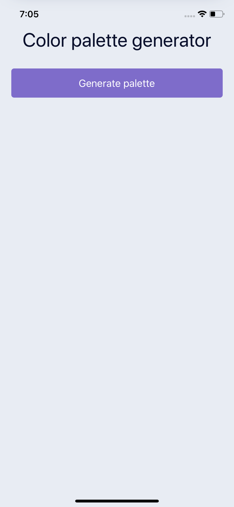
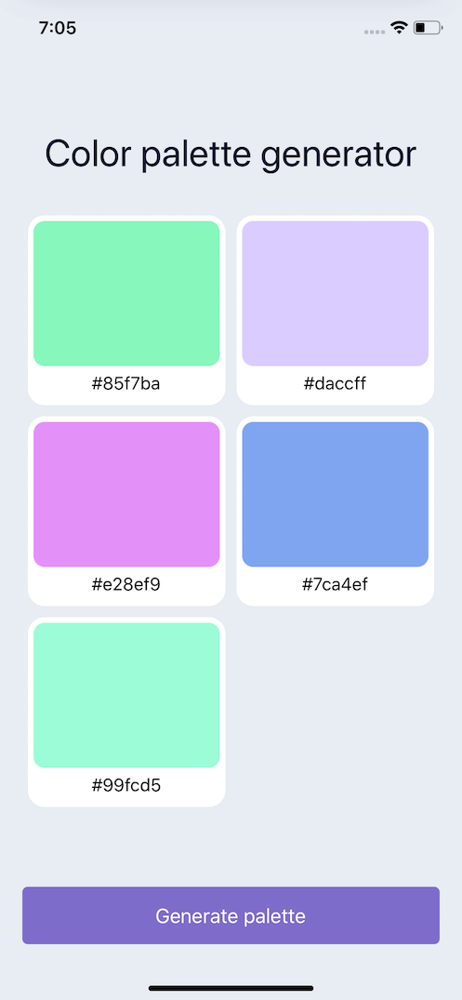
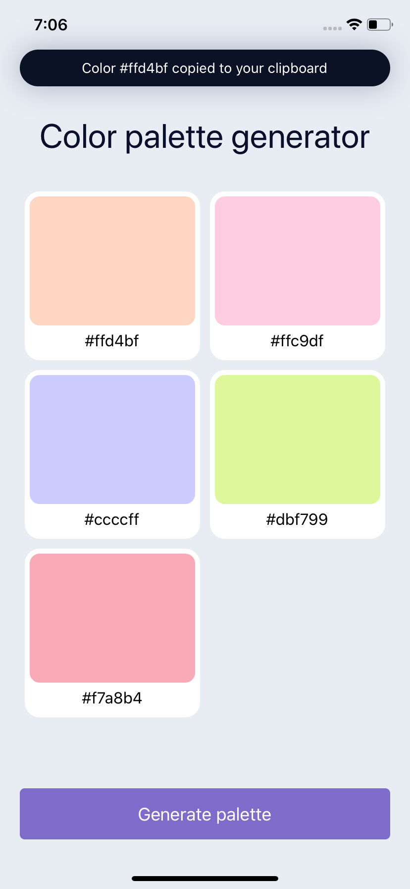

export const meta = {
  title: "Animated Color Palette Generator in React Native",
  description:
    "To create an animated color palette generator we're going to use the `Animated` library supplied by React Native. Some external libraries for generating consistent colors. Also we will use `useLayoutEffect`, `useEffect`, and `useState` hooks to automatically respond to changes in state to cause our animations to trigger.",
  createdAt: "2020-06-28T04:50:33.050263+00:00",
};

# Animated Color Palette Generator in React Native

To create an animated color palette generator we're going to use the `Animated` library supplied by React Native. Some external libraries for generating consistent colors. Also we will use `useLayoutEffect`, `useEffect`, and `useState` hooks to automatically respond to changes in state to cause our animations to trigger.

An inspiration from [UIDesignDaily](https://uidesigndaily.com/posts/sketch-color-palette-generator-picker--day-1114) but with some added polish. Including animated from the previous color to the next color, and animating the toast message when a color is selected.

<MP4 src="./ColorShift.mp4" />

## Setup a Title and Button

We'll need a few libraries to help us out in accomplishing our desired interactions. We'll use `randomcolor` to generate a random hex color, the `hex-to-hsl` helps us convert HSL so the animations are smoother from color to color. And our the `react-use-previous` will help us track what the previous colors were.

We'll touch more on these later

```
npm install hex-to-hsl react-use-previous randomcolor
// or
yarn add hex-to-hsl react-use-previous randomcolor
```

This will be our base component for now. We will first add a button that's a `TouchableOpacity`, as well as a title inside of our container.

```jsx
import React from "react";
import { StyleSheet, Text, View, TouchableOpacity } from "react-native";
import usePrevious from "react-use-previous";
import hexToHsl from "hex-to-hsl";
import randomColor from "randomcolor";

export default function App() {
  return (
    <View style={styles.container}>
      <Text style={styles.title}>Color palette generator</Text>
      <View>
        <TouchableOpacity style={styles.generateButton}>
          <Text style={{ color: "#FFF", fontSize: 18 }}>Generate palette</Text>
        </TouchableOpacity>
      </View>
    </View>
  );
}
```

We create some styles, the first is our container to tell it to take up our entire screen with a background color. Then we supply our title style, and our generate button style.

```js
const styles = StyleSheet.create({
  container: {
    flex: 1,
    paddingVertical: 50,
    paddingHorizontal: 20,
    backgroundColor: "#E8ECF3",
  },
  title: {
    fontSize: 34,
    color: "#0A102C",
    textAlign: "center",
    marginBottom: 30,
  },
  generateButton: {
    backgroundColor: "#7E6CCA",
    shadowOffset: { width: 0, height: 0 },
    shadowRadius: 6,
    shadowColor: "#7E6CCA",
    borderRadius: 5,
    paddingVertical: 15,
    alignItems: "center",
    justifyContent: "center",
  },
});
```



## Create a Color Card Component

Next we need to create our `ColorCard`. This will be a component that we use for rendering all of our colors. So it needs to take 2 props. The first is the `color` prop and the second is the `onPress` so we can trigger the toast animation later when a user presses on the color card.

Because we need to handle a press we wrap in a `TouchableOpacity`. The outer wrap is set to `50%` so that we can display 2 cards side by side. Then we take our `color` that we passed in and set it on an `Animated.View` so we can animate this color later.

```jsx
const ColorCard = ({ color, onPress }) => {

  return (
    <TouchableOpacity
      style={{
        width: "50%",
        height: 180,
        padding: 5,
      }}
      onPress={onPress}
    >
      <View
        style={{
          padding: 5,
          backgroundColor: "#FFF",
          borderRadius: 15,
          height: "100%",
        }}
      >
        <Animated.View
          style={{
            backgroundColor: color
            padding: 10,
            borderRadius: 10,
            flex: 1,
          }}
        />
        <View
          style={{
            paddingVertical: 5,
            alignItems: "center",
            justifyContent: "center",
          }}
        >
          <Text
            style={{
              fontSize: 16,
            }}
          >
            {color}
          </Text>
        </View>
      </View>
    </TouchableOpacity>
  );
};
```

## Generate Random Colors

Now that we have a card to render we need to create some colors to actually render.

First we setup a function to get a random color. This is just a helper function that will return a call to the `randomcolor` library. This can be adjusted based upon the styles of colors you want to generate.

Also depending on how many you want to generate you can control by setting a differing amount on state. Here I made a function called `get5New` that we can call at any time to get a new set of 5 colors.

```js
const getColor = () => {
  return randomColor({
    luminosity: "light",
    hue: "random",
  });
};

const get5New = () => {
  return [getColor(), getColor(), getColor(), getColor(), getColor()];
};
```

In our app we'll just bootstrap the initial state by calling our function and returning the first array of 5 colors.

```js
const [colors, setColors] = useState(get5New());
```

Depending on the screen size the height of our cards may not fit on the screen. So we will wrap it in a `ScrollView`. We set the outer to `flex: 1` so that the ScrollView will take up the rest of the available space, and the button will take up the rest.

You can then have the button stay clickable, and all the colors scrollable.

Another key piece to this is setting our `View` wrapping our `ColorCard`s to `flexDirection: 'row'` and also setting it to `flexWrap: 'wrap'`. This will then let each card render in a row, 2 at a time then wrap others to the next line.

```jsx
<ScrollView style={{ flex: 1 }}>
  <View
    style={{
      flex: 1,
      justifyContent: "center",
    }}
  >
    <Text style={styles.title}>Color palette generator</Text>
    <View
      style={{
        flexDirection: "row",
        flexWrap: "wrap",
      }}
    >
      {colors.map((color, index) => {
        return <ColorCard key={index} color={color} />;
      })}
    </View>
  </View>
</ScrollView>
```

Now that we can update our colors, we can add an `onPress` to our button and update our `colors` state with a whole new set of `5` colors.

```jsx
<View>
  <TouchableOpacity
    style={styles.generateButton}
    onPress={() => {
      setColors(get5New());
    }}
  >
    <Text style={{ color: "#FFF", fontSize: 18 }}>Generate palette</Text>
  </TouchableOpacity>
</View>
```



## Animate the Color when Changed

In order to animate from one color to another we need to keep track of what the previous color was. We can use the `react-use-previous` hook to pass in our color. Upon changing the `prevColor` will hold onto what our previous color was.

In order to render an initial color we will set our `prevColor` to the current color in the event we don't have one. Which we won't until the color changes once.

```jsx
const [animation] = useState(new Animated.Value(0));
const prevColor = usePrevious(color)?.current || color;
```

Then we can use the `useLayoutEffect` hook. This will allow us to update the animation state accordingly before the user can see it. This plays a key part in conjunction with our `interpolate` call below. We use the `color` prop as the hook dependency so that when the color changes our effect will re-run causing our animation to trigger.

The `Animated.timing` takes our `animation` value that we're interpolating off of and animates it to `1` over `1000ms`

```jsx
useLayoutEffect(() => {
  animation.setValue(0);
  Animated.timing(animation, {
    toValue: 1,
    duration: 1000,
    useNativeDriver: false,
  }).start();
}, [color]);
```

The interpolate will create a smooth transition from a `0 => 1` value but turned into colors. When the component re-renders with a new color we need to quickly shift the color rendered to `0` and transition it to `1`. The color will quickly swap when we call the `setValue(0)` in our `useLayoutEffect`. With our interpolate our `inputRange` goes from `0` to `1` and our `outputRange` are our 2 colors.

When a color changes the color the view is, quickly becomes the `prevColor`. The `inputRange` is set back to `0`. So we are still rendering the color the view was showing. Then our animation kicks off and animates to `1` which will be the actual current color supplied by props.

Converting from `hex` to `hsl` color format allows us to have smooth color animations from one color to the next with out jumping around from color to color like `rgb` would.

```jsx
<Animated.View
  style={{
    backgroundColor: animation.interpolate({
      inputRange: [0, 1],
      outputRange: [getHSLString(prevColor), getHSLString(color)],
    }),
    padding: 10,
    borderRadius: 10,
    flex: 1,
  }}
/>
```

This uses the `hex-to-hsl` library and then using destructuring we can grab each piece and return the necessary string.

```js
const getHSLString = (color) => {
  const [h, s, l] = hexToHsl(color);
  return "hsl(" + h + "," + s + "%," + l + "%)";
};
```

## Create a Toast

For a more reusable component we first create an independent toast component. It receives the color, and renders.

```jsx
const ToastBar = ({ color }) => {
  return (
    <View style={styles.toast}>
      <Text
        style={{
          color: "#FFF",
        }}
      >
        Color {color} copied to your clipboard
      </Text>
    </View>
  );
};
```

The toast component being it's own independent component means we can wrap it and position it anywhere, as well as animate it however we want.

We'll start by positioning the toast exactly where we want it to appear, and then can move it away with our animation. We'll place it at the 50 points from the top and 20 from each side.

```jsx
<Animated.View style={[styles.toastPosition]}>
  <ToastBar color={selectedColor} />
</Animated.View>
```

```js
toastPosition: {
    position: "absolute",
    top: 50,
    left: 20,
    right: 20,
    zIndex: 10,
},
toast: {
    backgroundColor: "#0C1226",
    shadowColor: "#A8B2C3",
    shadowOffset: { width: 0, height: 0 },
    shadowRadius: 15,
    shadowOpacity: 1,
    borderRadius: 29,
    paddingHorizontal: 20,
    paddingVertical: 10,
    alignItems: "center",
    justifyContent: "center",
}
```

## Animate a Toast Alert

To animate our toast we need to hold onto 2 pieces of state. The first being the color that was pressed, and then also the animated value to bring the toast into view.

```jsx
const [selectedColor, setSelectedColor] = useState();
const [animatedValue] = useState(new Animated.Value(0));
```

We can setup a `useEffect` hook to watch for a color to be selected. Which we add as a dependency `[selectedColor]` to our hook.

If a color is selected we will trigger our animation.

```jsx
useEffect(() => {
  if (selectedColor) {
  }
}, [selectedColor]);
```

For our toast, we will animate from `0` to `1` and use interpolate to move it in and out of view. At `0` which is the initial value, we will translate the toast off screen `-100`. So it will sit above the screen but out of view.

When animated to `1` the `translateY` will be `0` and the toast bar will sit at the spot we positioned it with no animation applied.

```jsx
<Animated.View
  style={[
    styles.toastPosition,
    {
      transform: [
        {
          translateY: animatedValue.interpolate({
            inputRange: [0, 1],
            outputRange: [-100, 0],
          }),
        },
      ],
    },
  ]}
>
  <ToastBar color={selectedColor} />
</Animated.View>
```

To trigger the animation we do need to use the `onPress` function prop and call the `setSelectedColor` function to update state.

```jsx
<ColorCard
  key={index}
  color={color}
  onPress={() => {
    setSelectedColor(color);
  }}
/>
```

For our animation we want the toast to appear, but not linger. So we want to to hide eventually. To do this we can utilize the `sequence` functionality provided by `Animated`. We reset our `animatedValue` back to `0` so the toast is hidden. Then we trigger sequence to `spring` into place. We animate to `1` which our interpolate will go from `-100` to `0` and our toast will appear.

Then we use `delay` to wait 1 second. Then we `spring` back to `0`.

```jsx
useEffect(() => {
  if (selectedColor) {
    animatedValue.setValue(0);
    Animated.sequence([
      Animated.spring(animatedValue, {
        toValue: 1,
        useNativeDriver: true,
      }),
      Animated.delay(1000),
      Animated.spring(animatedValue, {
        toValue: 0,
        useNativeDriver: true,
      }),
    ]).start();
  }
}, [selectedColor]);
```



## Ending

Now we have a complete animated color palette generator. We went over `Animated` and how we can create sequences of animations to show, wait, and then hide an item. As well as how to use `interpolate` to leverage animated values to transition colors.

<MP4 src="./ColorShift.mp4" />
